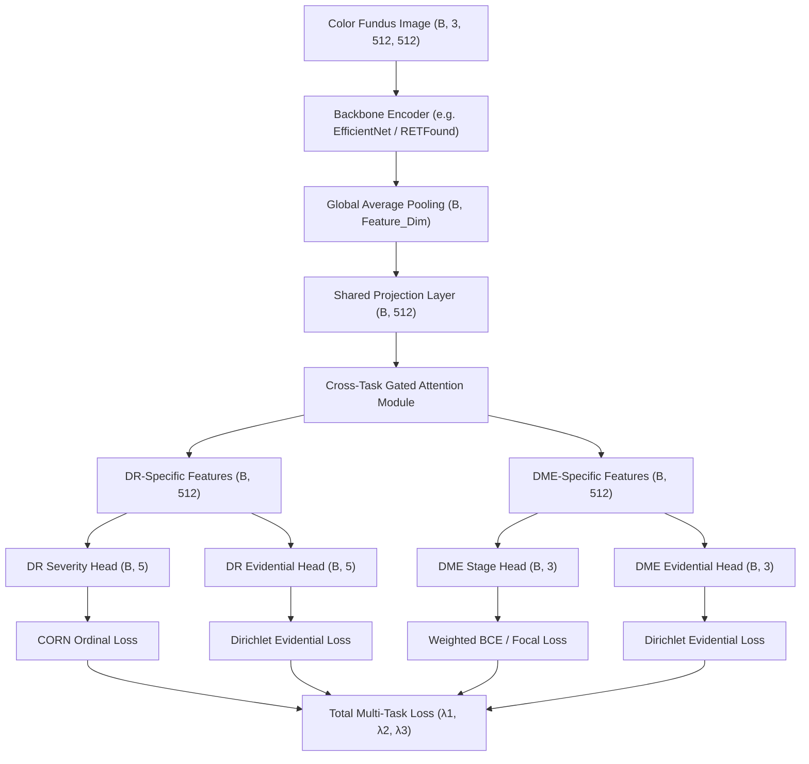

# ORD-MED: Ordinal Multi-task Evidential Diabetic Eye Disease Network

ORD-MED is a production-quality, modular PyTorch research framework designed for the joint diagnosis of Diabetic Retinopathy (DR) grading and Diabetic Macular Edema (DME) staging from color retinal fundus images. 

To assist clinical decision-making, the network integrates **ordinal severity regression**, **subjective logic-based evidential deep learning** for predictive uncertainty estimation, and an **automated patient referral module**. It is fully extensible for future multimodal (Fundus + OCT) architectures.

---

## Architecture Overview



### Key Architectural Layers
1. **Backbone Encoder**: Standardized interface supporting CNNs (e.g. `timm` EfficientNets) and Vision Transformers (e.g. Moorfields `RETFound` ViT-Large).
2. **Shared Projection Layer**: Decouples the backbone feature dimensions from downstream layers, standardizing them to a unified dimension (default: 512) and applying configured dropout.
3. **Cross-Task Gated Attention**: Employs learned element-wise attention gates to separate the shared latent representation into task-specific features for DR and DME, preventing negative transfer.
4. **Task-Specific Classification & Ordinal Heads**:
   - **DR Head**: Outputs logits for DR classification. Optimised using **CORN** (Conditional Ordinal Regression) or Earth Mover's Distance (EMD) to capture the natural ordered severity scale of DR.
   - **DME Head**: Outputs logits for DME staging. Optimised using class-weighted Binary Cross Entropy (BCE) or Focal Loss to manage class imbalances.
5. **Evidential Heads**: Map task features to subjective evidence values ($\alpha_k \ge 1$) using positive Softplus activations. The parameters define a Dirichlet probability distribution over class probabilities, yielding a direct measure of epistemic uncertainty ($u = K / S$, where $S = \sum \alpha_k$).
6. **Clinical Referral Module**: Flags cases for manual human specialist review if the predicted severity exceeds clinical boundaries (e.g. Moderate DR) or if the model's epistemic uncertainty exceeds a safe threshold (e.g., $u \ge 0.40$).

---

## Folder Structure

```text
ORD-MED/
├── configs/                # Configuration files
│   └── base_config.yaml    # Hyperparameter settings (mixed precision, lambdas, dropout, etc.)
├── datasets/               # Data loaders and preprocessing
│   ├── __init__.py
│   ├── dataset.py          # PyTorch DiabeticEyeDataset and Dataloader utilities
│   └── transforms.py       # Albumentations pipelines (Contrast enhancement CLAHE, Flips, normalize)
├── evaluators/             # Validation loop orchestrators
│   ├── __init__.py
│   └── evaluator.py        # MultiTaskEvaluator (aggregates predictions and computes scores)
├── inference/              # Production deployment predictors
│   ├── __init__.py
│   └── predictor.py        # Predictor API (supports local files, PIL Images, and numpy inputs)
├── models/                 # Neural network layers
│   ├── __init__.py         # OrdMedNet composite class and build_model factory
│   ├── backbones/          # Feature extractors
│   │   ├── __init__.py     # Backbone loader registry
│   │   ├── efficientnet.py # CNN timm wrapper
│   │   └── retfound.py     # ViT-Large retinal foundation model wrapper
│   ├── heads/              # Task diagnostic projections
│   │   ├── __init__.py
│   │   ├── dr_head.py      # DR classification logits output
│   │   ├── dme_head.py      # DME classification logits output
│   │   └── evidence_head.py # Dirichlet alpha evidence output
│   ├── losses/             # Loss modules
│   │   ├── __init__.py
│   │   ├── ordinal_loss.py # CORNLoss and EMDLoss
│   │   ├── evidential_loss.py # Dirichlet Bayes risk and KL-divergence regularizer
│   │   └── multitask_loss.py # MultiTaskLoss coordinator and FocalLoss
│   └── modules/            # Refinement and routing layers
│       ├── __init__.py
│       ├── shared_projection.py # Feature size standardizer
│       ├── task_attention.py # Cross-task gated attention separator
│       └── referral_module.py # Clinical referral decision module
├── notebooks/              # Jupyter prototyping notebooks
├── outputs/                # Evaluation & training reports
│   ├── checkpoints/        # Saved model checkpoint states (.pth)
│   ├── figures/            # Performance charts & Grad-CAM visual heatmaps
│   ├── logs/               # Log records and TensorBoard SummaryWriter events
│   └── predictions/        # Output predictions spreadsheets (CSV and JSON)
├── scripts/                # Execution utility scripts
├── tests/                  # Integration & unit test suites
│   ├── __init__.py
│   ├── test_model.py       # Forward shape sanity tests
│   └── test_losses.py      # Loss function mathematical unit tests
├── train.py                # Main script to run training pipeline
├── evaluate.py             # Checkpoint evaluation script
├── predict.py              # CLI inference engine
├── gradio_app.py           # Web GUI portal demo script
├── verify_forward_backward.py # Forward/backward validation script
└── requirements.txt        # Python package prerequisites
```

---

## Installation

1. Clone the project repository:
   ```bash
   git clone https://github.com/your-username/ord-med.git
   cd ord-med
   ```

2. Establish a Python virtual environment and activate it:
   ```bash
   python -m venv venv
   # Windows:
   venv\Scripts\activate
   # Linux/macOS:
   source venv/bin/activate
   ```

3. Install requirements (CPU version recommended for lightweight validation; omit the CPU index url if GPU support is needed):
   ```bash
   # CPU-only installation (fast for local verification)
   pip install torch torchvision --index-url https://download.pytorch.org/whl/cpu
   pip install -r requirements.txt
   
   # For GPU installation, run:
   # pip install -r requirements.txt
   ```

---

## Dataset Format

Annotations should be structured in CSV files (e.g. `data/train.csv`) containing at least the following columns:
- `image_id`: Filename of the color fundus image (e.g., `img_0023.png`).
- `dr_grade`: Ordinal DR grade index in range `[0, 4]` (0: Normal, 1: Mild, 2: Moderate, 3: Severe, 4: Proliferative).
- `dme_stage`: DME severity stage index in range `[0, 2]` (0: None, 1: Mild/Non-center involving, 2: Severe/Center-involving).

Example layout of a dataset CSV:
```csv
image_id,dr_grade,dme_stage
patient_001.png,0,0
patient_002.png,2,1
patient_003.png,4,2
```

Configure these file paths in `configs/base_config.yaml` or provide them when launching training.

---

## Training

Run the training pipeline with:
```bash
python train.py --config configs/base_config.yaml
```

### Advanced Options:
- **Resuming Training**: Provide a path to a saved checkpoint file using the command line argument or config options to restore parameters, optimizer weights, and learning rate state:
  ```bash
  python train.py --config configs/base_config.yaml --checkpoint outputs/checkpoints/base_efficientnet_b4_latest.pth
  ```
- **Mixed Precision**: Accelerated training via Automatic Mixed Precision (AMP) is enabled by default in `use_amp: true` under the `trainer:` block in the config.
- **Gradient Clipping**: Regulated up to `max_grad_norm: 5.0` within `trainers/trainer.py` to prevent gradient explosion.
- **Monitoring**: Run TensorBoard to view logs:
  ```bash
  tensorboard --logdir=outputs/logs/
  ```

---

## Evaluation

Assess a trained model checkpoint on the validation or test split:
```bash
python evaluate.py --config configs/base_config.yaml --checkpoint outputs/checkpoints/base_efficientnet_b4_best.pth --split test
```

### Outputs Generated:
- **Tabular Predictions**: Saved to `outputs/predictions/predictions_test.csv`.
- **JSON & CSV Reports**: Exported metrics written to `outputs/reports/metrics_test.json` and `outputs/reports/metrics_test.csv`.
- **Publication-Quality Plots**:
  - `dr_confusion_matrix.png` and `dme_confusion_matrix.png` (Counts + normalized row percentages).
  - `dr_roc_curves.png` and `dme_roc_curves.png` (One-vs-rest per-class curves with AUC score annotations).
  - `dr_pr_curves.png` and `dme_pr_curves.png` (One-vs-rest per-class curves with AP score annotations).
  - `dr_calibration_curve.png` and `dme_calibration_curve.png` (Reliability diagram binned Accuracies vs Confidences with count histograms).
  - `dr_uncertainty_vs_accuracy.png` and `dme_uncertainty_vs_accuracy.png` (Verification of epistemic calibration: accuracy drops as uncertainty increases).

---

## Inference

### 1. Command Line Interface (CLI)

Run predictions on a single image or an entire folder of fundus images:
```bash
# Predict single image
python predict.py --image_path path/to/eye.jpg --config configs/base_config.yaml --checkpoint outputs/checkpoints/base_efficientnet_b4_best.pth

# Predict all images in a folder, export a batch prediction CSV, and generate Grad-CAMs
python predict.py --image_path path/to/folder/ --config configs/base_config.yaml --checkpoint outputs/checkpoints/base_efficientnet_b4_best.pth --gradcam
```

### 2. Predictor Python API

Integrate ORD-MED predictions directly into external python projects:
```python
import torch
from config import Config
from models import build_model
from datasets.transforms import get_inference_transforms
from utils.checkpoint import load_checkpoint
from inference import Predictor

# 1. Load config and model weights
config = Config.load_from_yaml("configs/base_config.yaml")
model = build_model(config)
model, _, _ = load_checkpoint(model, "outputs/checkpoints/base_efficientnet_b4_best.pth")

# 2. Instantiate Predictor
transforms = get_inference_transforms(config)
predictor = Predictor(model=model, transforms=transforms, device=torch.device("cpu"), config=config)

# 3. Predict from filepath, PIL Image, or Numpy Array
results = predictor.predict("path/to/retinal_image.png")

print("DR Predicted Grade:", results["DR Grade"])
print("DME Predicted Stage:", results["DME"])
print("Epistemic Uncertainty:", results["Uncertainty"])
print("Referral Decision Flag:", results["Referral Decision"])
```

### 3. Interactive Gradio GUI

Launch the local web browser portal:
```bash
python gradio_app.py --config configs/base_config.yaml --checkpoint outputs/checkpoints/base_efficientnet_b4_best.pth
```
Upload an image to review the diagnostic metrics and visually inspect the side-by-side explainability Grad-CAM heatmaps for both the DR and DME branches.

---

## Future RETFound and Multimodal Extensions

### 1. Loading official RETFound weights
RETFound is pre-trained using a Masked Autoencoder (MAE) on large retinal image databases. To swap to RETFound:
1. In `configs/base_config.yaml`, update `encoder.name` to `"retfound"` and set `encoder.checkpoint_path` to your downloaded `RETFound_cfp_weights.pth` file.
2. The network loader `models/backbones/retfound.py` will automatically:
   - Instantiate a Vision Transformer (`vit_large_patch16_224` via `timm`).
   - Map and load key-value weights from the MAE checkpoint, ignoring outer projection heads.
   - Adjust output features dimension to 1024, passing it cleanly into the `SharedProjection` layer.

### 2. Extension to Multimodal Integration (Fundus + OCT)
The modular design is built with future **Multimodal Fusion** in mind. Integrating 3D Optical Coherence Tomography (OCT) alongside 2D Fundus images can be achieved by:
1. **Dual Encoders**: Adding an OCT 3D CNN or ViT backbone encoder under `models/backbones/`.
2. **Latent Projection**: Projecting fundus and OCT features into a shared fusion latent space (e.g. 512 dimensions) using separate `SharedProjection` layers.
3. **Cross-Attention Fusion Module**: Replacing or wrapping the `TaskAttention` module to compute cross-modal attention between fundus features $F_f$ and OCT features $F_o$, generating a unified multimodal latent embedding:
   ```python
   # Future Multimodal Forward Example
   fundus_features = self.fundus_projection(self.fundus_backbone(x_fundus))
   oct_features = self.oct_projection(self.oct_backbone(x_oct))
   
   # Cross-modal fusion
   fused_representation = self.fusion_attention(fundus_features, oct_features)
   
   # Feed to existing attention and diagnostic heads
   dr_feat, dme_feat = self.task_attention(fused_representation)
   ```
4. All downstream heads (DR, DME, Evidential) and losses (CORN, EMD, Dirichlet) remain completely unchanged, ensuring the existing research configurations remain perfectly valid.
